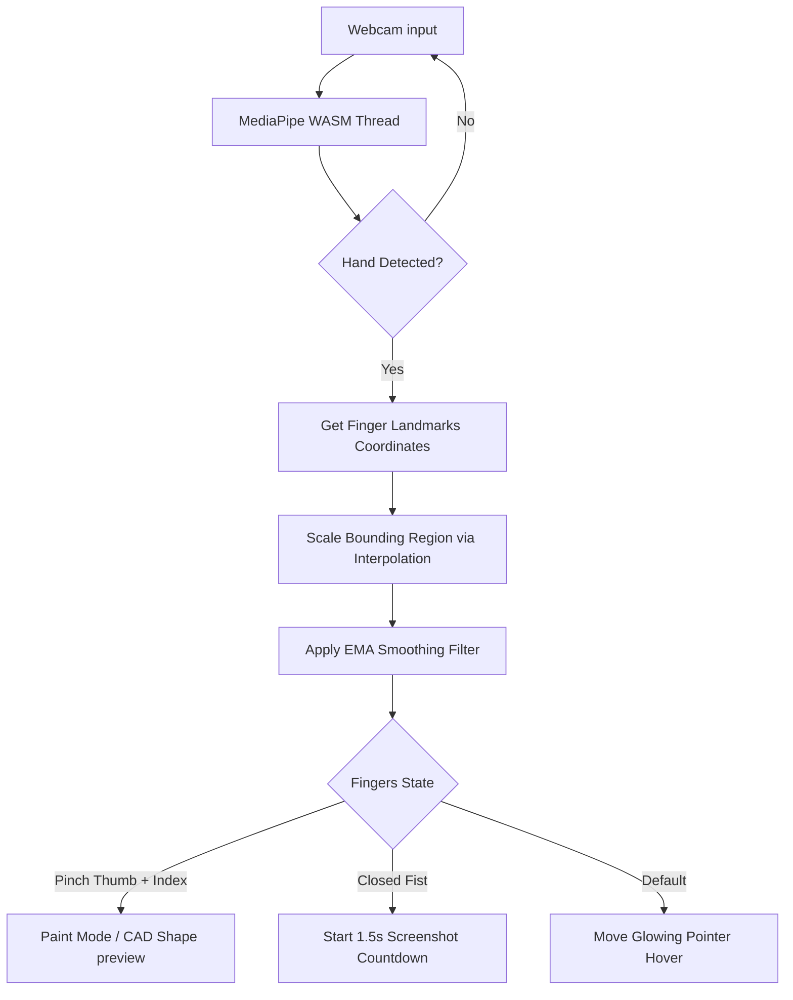

# AURA — Web-Based AI Hand Gesture Sketchpad Studio

AURA is an interactive, zero-latency client-side air drawing application powered by **MediaPipe WebAssembly (WASM)** and **Streamlit**. It allows users to paint, draw shapes, and control canvas states in real time through webcams using advanced hand gesture classification algorithms.

---

## ⚡ Key Highlights
*   **100% Edge Processing (Zero-Latency)**: Coordinates calculations run fully client-side in the browser using WebAssembly. No camera streams or images are transmitted to servers, ensuring maximum privacy and instant feedback.
*   **Drawing-Safe Calibrations**: Slider parameters communicate directly with JavaScript tracking loops. Adjusting thresholds (e.g. tracking boundaries, smoothing factors) updates WASM thresholds dynamically at 60fps **without resetting your camera or wiping your drawing**.
*   **CAD Shape Assistant**: Pinch and drag to draw perfect geometric vectors (lines, circles, rectangles) with real-time vector guideline previews, stamped onto the canvas when the pinch is released.

---

## 🛠️ Technology Stack
1.  **Core Vision Processing**: [MediaPipe Hands](https://github.com/google/mediapipe) (WASM compilation) for 21-point hand skeleton tracking.
2.  **UI & Server Wrapper**: [Streamlit](https://streamlit.io/) for hosting, layouts, theme styling, and routing.
3.  **Drawing Engine**: HTML5 `<canvas>` API with custom pixel-buffer caching for vector previews.
4.  **UI Styling**: CSS3 Custom variables with Glassmorphic backdrops and layout spacing.
5.  **Audio HUD Feedbacks**: Web Audio API Oscillators synthesizing custom sound clicks and camera shutter effects.

---

## 🎮 Hand Gestures Cheatsheet

| Gesture | Finger State | Action / Trigger |
| :--- | :--- | :--- |
| **Hover Pointer** | Fingers extended separate | glowing tracking dot follows your index finger |
| **Pinch-to-Sketch** | Index Tip pinched to Thumb Tip | Paints paths (Freehand, Lines, Circles, Rectangles) |
| **Fist Screenshot** | All 5 fingers closed in tight fist | Holds for 1.5s to snap screenshot of your canvas to gallery |
| **Undo Last stroke** | UI Click button trigger | Pops last coordinate snapshot to revert canvas state |

---

## 🔄 Architectural Workflow



---

## 📈 Engineering Details & Mathematical Filters

### 1. Hand Tremor Filtering (Exponential Moving Average)
To eliminate micro-jitter and hand tremors from index finger tracking, AURA implements an **Exponential Moving Average (EMA)** filter on output coordinates:

$$\mathbf{X}_{smoothed} = \alpha \cdot \mathbf{X}_{target} + (1 - \alpha) \cdot \mathbf{X}_{previous}$$

Where:
*   $\mathbf{X}_{smoothed}$ represents the output drawing coordinates.
*   $\alpha$ is the smoothing responsiveness factor (user-adjustable via calibration sliders). A lower value yields smoother paths by weighting previous states higher.

### 2. Active Region Linear Interpolation
To prevent shoulder and arm fatigue, users calibrate a sub-region (Active Bounding Box) in their camera viewport. Coordinates are mapped to the full drawing board space using 1D linear interpolation:

$$\mathbf{X}_{canvas} = \text{interp}(\mathbf{X}_{landmark}, [\mathbf{X}_{left}, \mathbf{X}_{right}], [0, \mathbf{W}_{canvas}])$$

This lets micro-hand movements inside the bounding box reach the edges of the drawing canvas comfortably.

---

## 🚀 Setup & Local Execution

### 1. Prerequisite
Verify that you have Python 3.8+ installed on your system.

### 2. Install Dependencies
Clone this repository, navigate to the directory, and install dependencies from the folder:
```bash
pip install -r requirements.txt
```

### 3. Run Streamlit Server
Start the web dashboard locally on your system:
```bash
streamlit run app.py
```
Open your browser and navigate to **`http://localhost:8501`** to draw!

---

## 📁 Repository Structure
*   [`app.py`](file:///c:/Users/mihir/Desktop/1_Cursor_Control_With_Hand_Gesture/app.py): Streamlit Single Page Application containing custom styles, top navbars, HTML5/JS iframe canvas components, and documentation sections.
*   [`requirements.txt`](file:///c:/Users/mihir/Desktop/1_Cursor_Control_With_Hand_Gesture/requirements.txt): List of dependencies needed for deployment.
*   [`main.py`](file:///c:/Users/mihir/Desktop/1_Cursor_Control_With_Hand_Gesture/main.py): Local desktop cursor controller baseline (maps coordinates to physical OS cursor using PyAutoGUI).
*   [`util.py`](file:///c:/Users/mihir/Desktop/1_Cursor_Control_With_Hand_Gesture/util.py): Math utilities supporting local coordinate filters.
