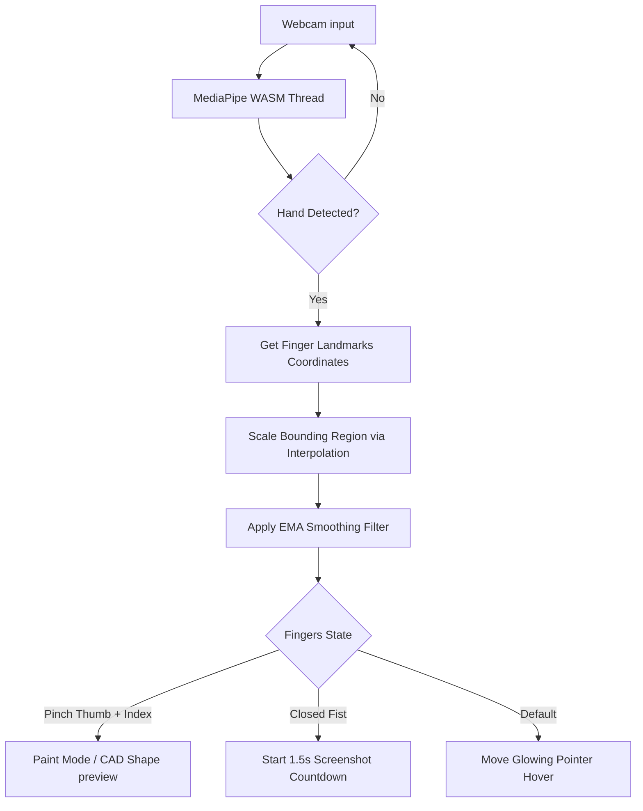

# AURA — Web-Based AI Hand Gesture Sketchpad Studio

AURA is an interactive, zero-latency client-side air drawing application powered by **MediaPipe WebAssembly (WASM)**. It allows users to paint, draw shapes, and control canvas states in real time through webcams using advanced hand gesture classification algorithms.

The application is structured to run fully client-side and can be hosted as a **static website on Vercel** or served via a **Streamlit wrapper**.

---

## ⚡ Key Highlights
*   **100% Edge Processing (Zero-Latency)**: Coordinates calculations run fully client-side in the browser using WebAssembly. No camera streams or images are transmitted to servers, ensuring maximum privacy and instant feedback.
*   **Drawing-Safe Calibrations**: Slider parameters communicate directly with JavaScript tracking loops. Adjusting thresholds (e.g., tracking boundaries, smoothing factors) updates WASM thresholds dynamically at 60fps **without resetting your camera or wiping your drawing**.
*   **CAD Shape Assistant**: Pinch and drag to draw perfect geometric vectors (lines, circles, rectangles) with real-time vector guideline previews, stamped onto the canvas when the pinch is released.
*   **Zero-Config Deployments**: Bundled into a standalone, single-page application ready to be hosted instantly on Vercel, Netlify, or Streamlit Cloud.

---

## 🛠️ Technology Stack
1.  **Core Vision Processing**: [MediaPipe Hands](https://github.com/google/mediapipe) (WASM compilation) for 21-point hand skeleton tracking.
2.  **Web App Preset**: Pure HTML5, CSS3, and JavaScript compiled into a single-file application.
3.  **Drawing Engine**: HTML5 `<canvas>` API with custom pixel-buffer caching for vector previews.
4.  **UI Styling**: CSS3 Custom variables with Glassmorphic backdrops and layout spacing.
5.  **Audio HUD Feedbacks**: Web Audio API Oscillators synthesizing custom sound clicks and camera shutter effects.
6.  **Server Wrapper**: [Streamlit](https://streamlit.io/) wrapper included for Python environment compatibility.

---

## 🎮 Hand Gestures Cheatsheet

| Gesture | Finger State | Action / Trigger |
| :--- | :--- | :--- |
| **Hover Pointer** | Fingers extended separate | Glowing tracking dot follows your index finger |
| **Pinch-to-Sketch** | Index Tip pinched to Thumb Tip | Paints paths (Freehand, Lines, Circles, Rectangles) |
| **Fist Capture** | All 5 fingers closed in tight fist | Holds for 1.5s to snap screenshot of your canvas to gallery |
| **Undo Last stroke** | Thumbs Down | Pops last coordinate snapshot to revert canvas state |
| **Confirm Shape** | Thumbs Up | Confirms and stamps active CAD shape assist guides |
| **Pause Tracking** | Open Palm | Pauses webcam coordination loop until released |

---

## 🔄 Architectural Workflow



---

## 📈 Engineering Details & Mathematical Filters

### 1. Hand Tremor Filtering (Exponential Moving Average)
To eliminate micro-jitter and hand tremors from index finger tracking, AURA implements an **Exponential Moving Average (EMA)** filter on output coordinates:

$$\mathbf{X}_{smoothed} = \alpha \cdot \mathbf{X}_{target} + (1 - \alpha) \cdot \mathbf{X}_{previous}$$

Where:
*   $\mathbf{X}_{smoothed}$ represents the output drawing coordinates.
*   $\alpha$ is the smoothing responsiveness factor (user-adjustable via calibration sliders). A lower value yields smoother paths by weighting previous states higher.

### 2. Active Region Linear Interpolation
To prevent shoulder and arm fatigue, users calibrate a sub-region (Active Bounding Box) in their camera viewport. Coordinates are mapped to the full drawing board space using 1D linear interpolation:

$$\mathbf{X}_{canvas} = \text{interp}(\mathbf{X}_{landmark}, [\mathbf{X}_{left}, \mathbf{X}_{right}], [0, \mathbf{W}_{canvas}])$$

This lets micro-hand movements inside the bounding box reach the edges of the drawing canvas comfortably.

---

## 🚀 Setup & Local Execution

### 1. Direct Web Preview (Recommended)
You can test the application instantly without any server setup:
```bash
# Run a lightweight local python server in the project directory
python -m http.server 8000
```
Open your browser and navigate to **`http://localhost:8000`** to draw!

### 2. Python Streamlit Execution
If you prefer running the app via the Streamlit backend wrapper:
1. Install Streamlit dependency:
   ```bash
   pip install -r requirements.txt
   ```
2. Start the local server:
   ```bash
   streamlit run app.py
   ```
3. Open your browser to **`http://localhost:8501`**.

---

## 🏗️ Production Compilations
If you modify the source files in `src/`, compile them into the production-ready root `index.html` by running:
```bash
python build.py
```

---

## 📁 Repository Structure
*   [`index.html`](file:///c:/Users/mihir/Desktop/1_Cursor_Control_With_Hand_Gesture/index.html): Standalone, compiled single-page production app containing inlined styles and scripts.
*   [`app.py`](file:///c:/Users/mihir/Desktop/1_Cursor_Control_With_Hand_Gesture/app.py): Streamlit wrapper serving the compiled index.html.
*   [`build.py`](file:///c:/Users/mihir/Desktop/1_Cursor_Control_With_Hand_Gesture/build.py): Compiler script that bundles all files in `src/` into the root index.html.
*   [`favicon.svg`](file:///c:/Users/mihir/Desktop/1_Cursor_Control_With_Hand_Gesture/favicon.svg): SVG favicon used as the website icon.
*   [`requirements.txt`](file:///c:/Users/mihir/Desktop/1_Cursor_Control_With_Hand_Gesture/requirements.txt): Minimal dependencies for Python environment.
*   [`src/`](file:///c:/Users/mihir/Desktop/1_Cursor_Control_With_Hand_Gesture/src): Folder containing the raw modular HTML, CSS, and JS components.
