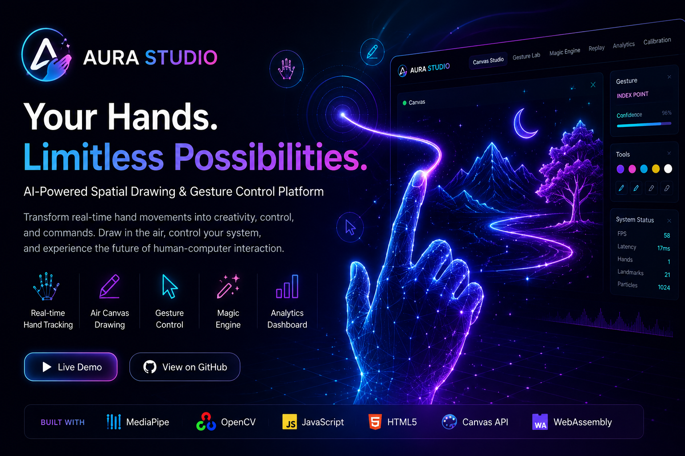
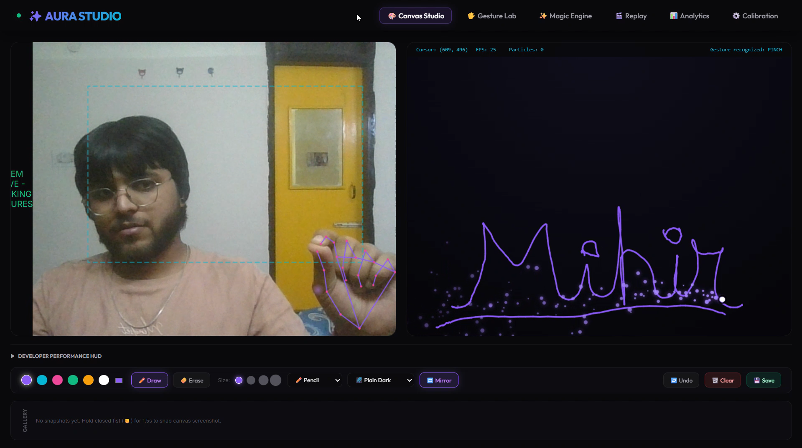
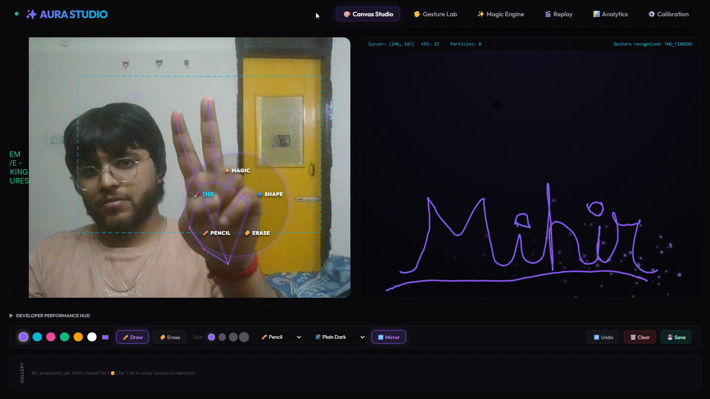
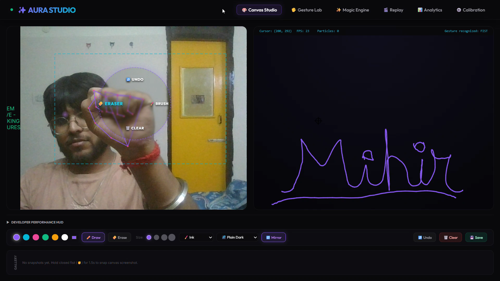
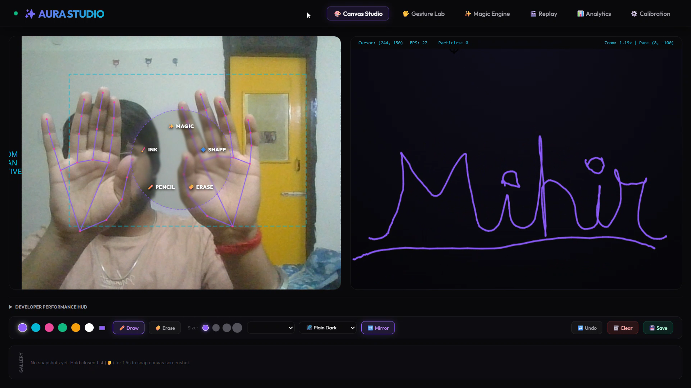
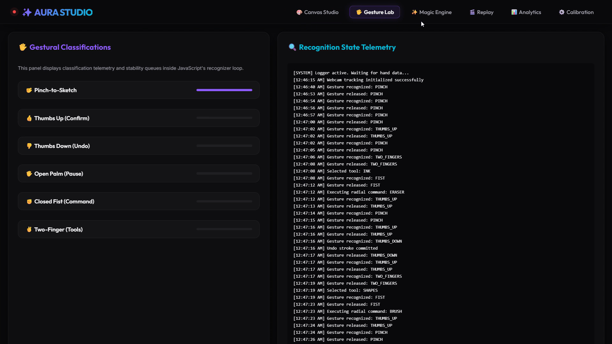
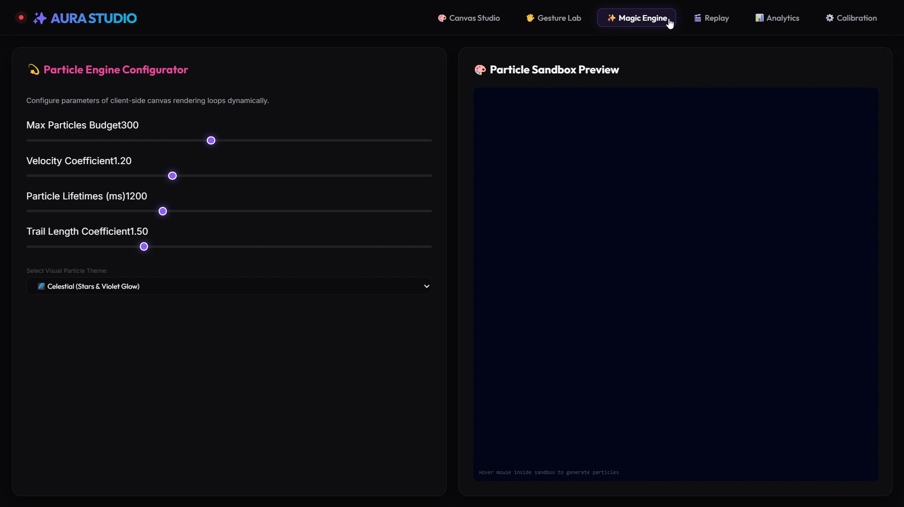
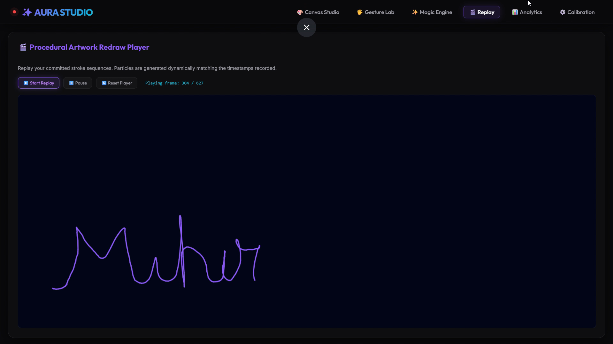
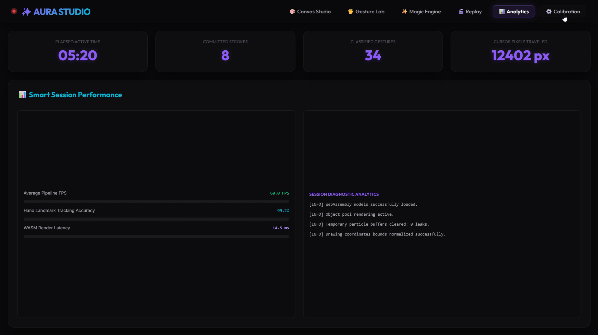
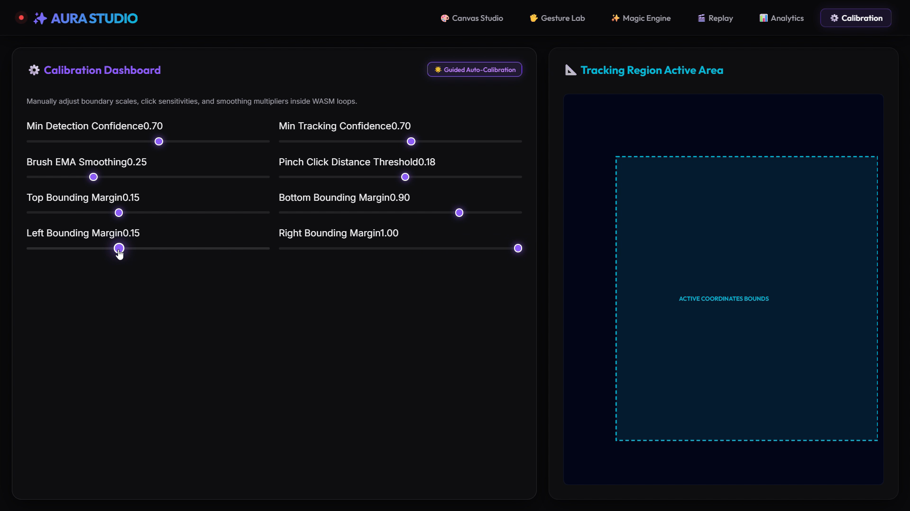

# ✨ AURA STUDIO

### AI-Powered Spatial Drawing & Gesture Control

<p align="center">
  <strong>Your Hands. Limitless Possibilities.</strong><br>
  <em>Turn real-time hand movement into creativity, control, and interaction.</em>
</p>

<p align="center">
  <a href="https://aura-studio-rosy.vercel.app/">🚀 Live Demo</a>
  &nbsp;•&nbsp;
  <a href="https://www.linkedin.com/in/mihir-gupta-980173299/">💼 LinkedIn</a>
</p>

---

<p align="center">
  
</p>

---

## 🧠 About AURA STUDIO

**AURA STUDIO** is a real-time computer-vision interaction platform that transforms ordinary webcam input into a **touchless spatial interface**.

Instead of relying on a mouse, keyboard, or physical drawing tablet, AURA interprets **hand landmarks, gestures, movement, and spatial coordinates** to create an interactive digital environment for drawing, navigation, commands, and creative expression.

Built around **MediaPipe hand tracking, HTML5 Canvas, JavaScript, Web APIs, and mathematical motion processing**, the system runs vision processing directly in the browser for a responsive, privacy-conscious experience.

> **AURA isn't just an air-drawing application — it explores a different way of interacting with computers.**

---

# 🎬 Experience AURA

<p align="center">
  
</p>

### ▶️ Full Demonstration

<p align="center">
  <a href="./AuraDrawingVideo.mp4">
    🎥 <strong>Watch the Full AURA STUDIO Demonstration</strong>
  </a>
</p>

---

# 🖼️ Product Gallery

## 01 — Canvas Studio

<p align="center">
  
</p>

---

## 02 — Tools Kit

<p align="center">
  
</p>

---

## 03 — Radial Shortcuts

<p align="center">
  
</p>

---

## 04 — Zoom & Pan

<p align="center">
  
</p>

---

## 05 — Gesture Lab

<p align="center">
  
</p>

---

## 06 — Magic Engine

<p align="center">
  
</p>

---

## 07 — Replay

<p align="center">
  
</p>

---

## 08 — Analytics

<p align="center">
  
</p>

---

## 09 — Calibration

<p align="center">
  
</p>

---

# ⚡ What Makes AURA Different?

AURA combines several layers of interaction into one system:

| Layer                      | Capability                                                |
| -------------------------- | --------------------------------------------------------- |
| 👁️ **Computer Vision**    | Real-time hand landmark tracking                          |
| ✋ **Gesture Intelligence** | Gesture classification and state detection                |
| 🎨 **Spatial Drawing**     | Draw directly through hand movement                       |
| 🖱️ **Interaction**        | Gesture-driven cursor and canvas control                  |
| ✨ **Magic Engine**         | Particle trails, bursts, and visual feedback              |
| 🧭 **Radial Shortcuts**    | Gesture-activated contextual controls                     |
| 📐 **Geometry Engine**     | Vector lines, circles, and rectangles                     |
| 📊 **Telemetry**           | FPS, latency, particles, and gesture monitoring           |
| 🎯 **Calibration**         | Personalized tracking area and motion mapping             |
| 🔊 **Audio Feedback**      | Context-aware synthesized interaction sounds              |
| 🔁 **Replay**              | Review and revisit drawing interactions                   |
| 🔐 **Privacy**             | Camera processing designed around local browser execution |

---

# 🎨 Core Experience

## 🖌️ Canvas Studio

The primary creative environment combines:

* Live webcam feed
* Real-time hand skeleton visualization
* Spatial cursor tracking
* Gesture-controlled drawing
* Adjustable brush sizes
* Multiple brush styles
* Custom color palette
* Eraser mode
* Undo / clear controls
* Canvas mirroring
* Vector shape assistance
* Drawing persistence and saving

The result is a **touchless digital canvas controlled entirely through hand movement**.

---

## ✋ Gesture Lab

AURA converts hand configurations into meaningful application commands.

### Gesture Interaction Map

| Gesture         | Interaction   | Result                             |
| :-------------- | :------------ | :--------------------------------- |
| ☝️ Index Finger | Hover / Move  | Controls spatial pointer           |
| 🤏 Pinch        | Draw / Select | Activates drawing interaction      |
| 👍 Thumbs Up    | Confirm       | Confirms an interaction            |
| 👎 Thumbs Down  | Undo          | Reverts the latest action          |
| ✊ Fist          | Command Mode  | Opens radial command controls      |
| ✌️ Two Fingers  | Tool Mode     | Opens tool selection               |
| ✋ Open Palm     | Pause         | Pauses active tracking interaction |

The gesture engine combines **landmark positions, finger states, distances, angles, and temporal state transitions** instead of relying on a single frame.

---

# ✨ Magic Engine

AURA adds a visual interaction layer on top of the core tracking engine.

The **Magic Engine** provides:

* ✨ Particle bursts
* 🌌 Cursor trails
* 💫 Drawing particles
* 🪄 Gesture-triggered effects
* 🌈 Dynamic visual feedback
* ⚡ Interaction animations

The objective is not simply decoration.

Every effect is tied to an interaction event, helping the interface communicate **what the system understood**.

---

# 🧭 Radial Shortcuts

AURA removes unnecessary UI navigation by allowing gestures to open contextual radial menus.

Instead of:

```text
Gesture
   ↓
Move mouse
   ↓
Find toolbar
   ↓
Click tool
```

AURA enables:

```text
Gesture
   ↓
Radial Menu
   ↓
Select Action
```

This creates a more natural **menu-free interaction loop**.

---

# 📐 Spatial & Mathematical Engine

AURA isn't simply drawing pixels based on raw webcam coordinates.

Several mathematical techniques are used to transform noisy camera data into usable interaction coordinates.

## 1. Exponential Moving Average Smoothing

Webcam-based tracking naturally contains small coordinate fluctuations.

AURA applies an EMA-based smoothing model:

$$
X_{smooth} = \alpha X_{target} + (1-\alpha)X_{previous}
$$

Where:

* `X_target` = current detected landmark position
* `X_previous` = previous smoothed position
* `α` = smoothing factor

This produces significantly smoother cursor movement and drawing strokes.

---

## 2. Spatial Coordinate Mapping

The hand operates inside a calibrated region of the webcam frame.

Coordinates are transformed from the camera-space region into canvas-space coordinates:

$$
X_{canvas} =
\frac{X_{landmark}-B_{left}}
{B_{right}-B_{left}}
\times W_{canvas}
$$

$$
Y_{canvas} =
\frac{Y_{landmark}-B_{top}}
{B_{bottom}-B_{top}}
\times H_{canvas}
$$

This allows relatively small hand movements to control a much larger digital workspace.

---

## 3. Vector Shape Assistant

AURA can interpret spatial movement as geometric primitives.

### Line

$$
(x_0,y_0) \rightarrow (x_1,y_1)
$$

### Circle

$$
R = \sqrt{(x_1-x_0)^2+(y_1-y_0)^2}
$$

### Rectangle

A bounding region is generated between the initial and final coordinates.

These shapes can be previewed during the gesture and committed to the permanent canvas on release.

---

# 📊 Developer Performance HUD

AURA exposes its internal runtime state through a compact performance telemetry layer.

Example metrics include:

```text
SYSTEM ACTIVE

FPS             31
HAND COUNT      1
LANDMARKS       21
CONFIDENCE      96%
LATENCY         Real-time
PARTICLES       0
GESTURE         THUMBS_UP
```

This makes the system easier to understand, debug, calibrate, and demonstrate.

---

# 🔬 Computer Vision Pipeline

The core interaction pipeline follows:

```text
                WEBCAM
                   │
                   ▼
          ┌─────────────────┐
          │  MediaPipe Hands│
          └────────┬────────┘
                   │
                   ▼
           21 Hand Landmarks
                   │
                   ▼
          Landmark Processing
                   │
                   ▼
       Finger / Gesture Analysis
                   │
                   ▼
          Temporal State Logic
                   │
          ┌────────┴────────┐
          ▼                 ▼
    Spatial Mapping    Gesture Actions
          │                 │
          ▼                 ▼
      Canvas Engine     UI / Commands
          │                 │
          └────────┬────────┘
                   ▼
             Magic Engine
                   │
                   ▼
           Visual Feedback
```

---

# 🛠️ Technology Stack

### 👁️ Computer Vision

* **MediaPipe Hands**
* **MediaPipe WebAssembly**
* Real-time hand landmark detection
* 21-point hand skeleton tracking

### 🎨 Rendering

* **HTML5 Canvas API**
* Multi-layer canvas architecture
* 2D rendering
* Particle rendering
* Vector drawing

### ⚙️ Application Logic

* **JavaScript ES6+**
* Modular JavaScript architecture
* Gesture state machines
* Coordinate transformation
* Motion smoothing
* Interaction handling

### 🎨 UI / Styling

* **HTML5**
* **CSS3**
* CSS custom properties
* Responsive layouts
* Glassmorphism
* Neon visual system
* CSS animations and transitions

### 🔊 Browser APIs

* Web Camera API
* Canvas API
* Web Audio API
* Browser rendering APIs

### 🐍 Python

* Python
* Streamlit
* Custom build/bundling workflow

### 🚀 Deployment

* **Vercel**
* Static production deployment
* HTTPS camera access
* Optional Streamlit execution environment

---

# 🏗️ Architecture

AURA follows a lightweight client-side architecture:

```text
                    AURA STUDIO
                         │
        ┌────────────────┼────────────────┐
        │                │                │
        ▼                ▼                ▼
   Vision Layer     Interaction       Rendering
        │                │                │
   MediaPipe         Gestures          Canvas
   Landmarks         State Logic       Particles
   Camera            Calibration       Shapes
        │                │                │
        └────────────────┼────────────────┘
                         │
                         ▼
                  Experience Layer
                         │
              ┌──────────┼──────────┐
              ▼          ▼          ▼
           Drawing     Controls    Effects
```

The browser performs the primary interaction processing, minimizing unnecessary network communication and keeping the experience responsive.

---

# 🧩 Project Structure

```text
AURA-STUDIO/
│
├── src/
│   ├── index.html
│   ├── styles.css
│   ├── app.js
│   ├── gestures.js
│   ├── calibration.js
│   ├── shapes.js
│   ├── particles.js
│   └── audio.js
│
├── screenshots/
│   ├── 1_Drawing.png
│   ├── 2_Tools_Kit.png
│   ├── 3_Radial_Shortcuts.png
│   ├── 4_Zoom_PAN.png
│   ├── 5_Gesture_Labs.png
│   ├── 6_Magic_Engine.png
│   ├── 7_Replay.png
│   ├── 8_Analytics.png
│   └── 9_Calibration.png
│
├── index.html
├── app.py
├── build.py
├── favicon.svg
├── requirements.txt
├── HeroBanner.png
├── AuraDrawingGIF.gif
├── AuraDrawingVideo.mp4
└── README.md
```

---

# 🚀 Run Locally

## Option 1 — Lightweight HTTP Server

Recommended for the client-side application.

```bash
git clone <your-repository-url>
cd AURA-STUDIO

python -m http.server 8000
```

Open:

```text
http://localhost:8000
```

> Camera access works best when the application is served through `localhost` or HTTPS.

---

## Option 2 — Streamlit

Install the required Python dependency:

```bash
pip install -r requirements.txt
```

Then:

```bash
streamlit run app.py
```

Open:

```text
http://localhost:8501
```

---

# 🔧 Build From Source

AURA uses a modular source structure that can be compiled into the production-ready root `index.html`.

After modifying files inside `src/`:

```bash
python build.py
```

This rebuilds the production HTML from the modular source assets.

---

# ☁️ Deployment

## Vercel

AURA is deployed as a lightweight static application.

### Production Demo

🚀 **Live Application:**
https://aura-studio-rosy.vercel.app/

The production deployment benefits from HTTPS, which is important for browser camera permissions.

### Deployment Flow

```text
GitHub
   │
   ▼
Vercel
   │
   ▼
Static Production Build
   │
   ▼
HTTPS
   │
   ▼
AURA STUDIO
```

---

# 🎯 Engineering Highlights

This project demonstrates practical implementation across multiple areas:

* Real-time computer vision
* Hand landmark processing
* Gesture recognition
* Browser-based ML/CV execution
* Coordinate transformation
* Motion smoothing
* Temporal state handling
* Canvas rendering
* Particle physics
* Vector geometry
* Web Audio synthesis
* Camera APIs
* Performance telemetry
* Calibration systems
* Responsive UI engineering
* Static production deployment

---

# 🔐 Privacy by Design

AURA is designed around **local-first interaction processing**.

The primary vision pipeline operates inside the browser, allowing webcam frames to be processed locally rather than requiring continuous transmission to a remote server.

This approach provides:

* Lower interaction latency
* Reduced network dependency
* Better privacy characteristics
* Lower infrastructure requirements
* Real-time browser interaction

> **Your camera becomes an input device — not a data upload pipeline.**

---

# ⚡ Performance Philosophy

Real-time computer vision introduces several practical challenges:

### Problem

Raw hand landmarks can contain:

* Camera noise
* Small coordinate fluctuations
* Tracking instability
* Frame-to-frame gesture changes
* Cursor jitter

### AURA's Approach

```text
Raw Landmark
     ↓
Coordinate Mapping
     ↓
EMA Smoothing
     ↓
Gesture State Logic
     ↓
Interaction Threshold
     ↓
Canvas / Command
```

The result is a more stable interaction experience than directly mapping raw landmark coordinates to the canvas.

---

# 🧠 Key Learning Outcomes

Building AURA STUDIO provided hands-on experience with:

### Computer Vision

Understanding how real-time hand landmark detection can become a usable interaction system.

### Machine Learning Concepts

Working with landmark-based features, gesture states, spatial relationships, and classification logic.

### Human–Computer Interaction

Designing interfaces where physical hand movement becomes a digital input mechanism.

### Real-Time Systems

Managing frame processing, smoothing, latency, rendering, and interaction stability simultaneously.

### Mathematical Modeling

Applying interpolation, distance calculations, geometric relationships, and exponential smoothing to real-world noisy input.

### Product Engineering

Turning an experimental computer-vision prototype into a structured, polished, deployable application.

---

# 🔮 Future Roadmap

AURA is designed with room to evolve beyond spatial drawing.

### Planned / Potential Extensions

* 🧠 Custom user-trained gestures
* 🤖 Gesture → natural-language command engine
* 🖱️ Full touchless computer control
* 🎤 Voice + gesture hybrid commands
* ✍️ Air-writing recognition
* 🎨 AI-assisted sketch enhancement
* 👥 Multi-hand interaction
* 🧊 3D spatial manipulation
* ♿ Accessibility-focused interaction modes
* 📈 Advanced gesture analytics
* 👤 Personalized gesture profiles

The long-term direction is to evolve AURA from an experimental drawing environment into a broader **touchless Human–Computer Interaction platform**.

---

# 🏆 Project Philosophy

> **Technology becomes powerful when the interface disappears.**

AURA explores what happens when the traditional boundary between **human movement and digital interaction** is removed.

No mouse.

No drawing tablet.

No physical controls.

Just movement, vision, and computation.

---

# 👨‍💻 Built By

### Mihir Gupta

**B.Tech CSE — AI & ML**

Interested in building intelligent systems at the intersection of:

**Artificial Intelligence · Computer Vision · Machine Learning · Software Engineering · Human–Computer Interaction**

<p align="center">
  <a href="https://aura-studio-rosy.vercel.app/">🚀 Explore AURA STUDIO</a>
  &nbsp;&nbsp;•&nbsp;&nbsp;
  <a href="https://www.linkedin.com/in/mihir-gupta-980173299/">💼 Connect on LinkedIn</a>
</p>

---

<p align="center">
  <strong>✨ AURA STUDIO</strong><br>
  <em>Your Hands. Limitless Possibilities.</em>
</p>
